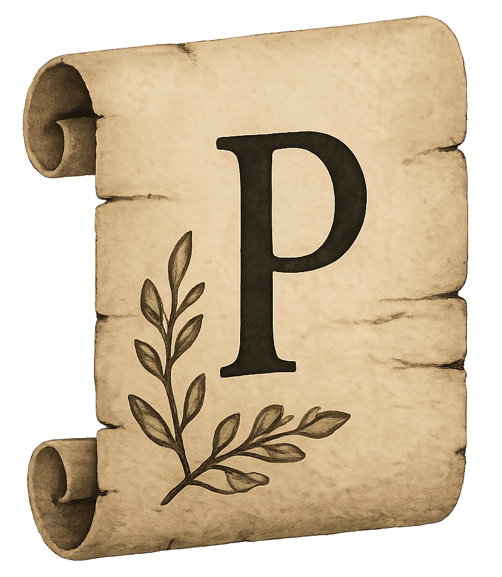
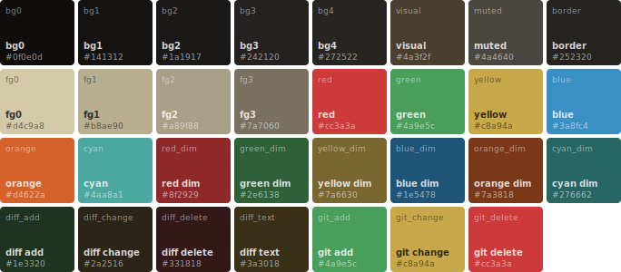
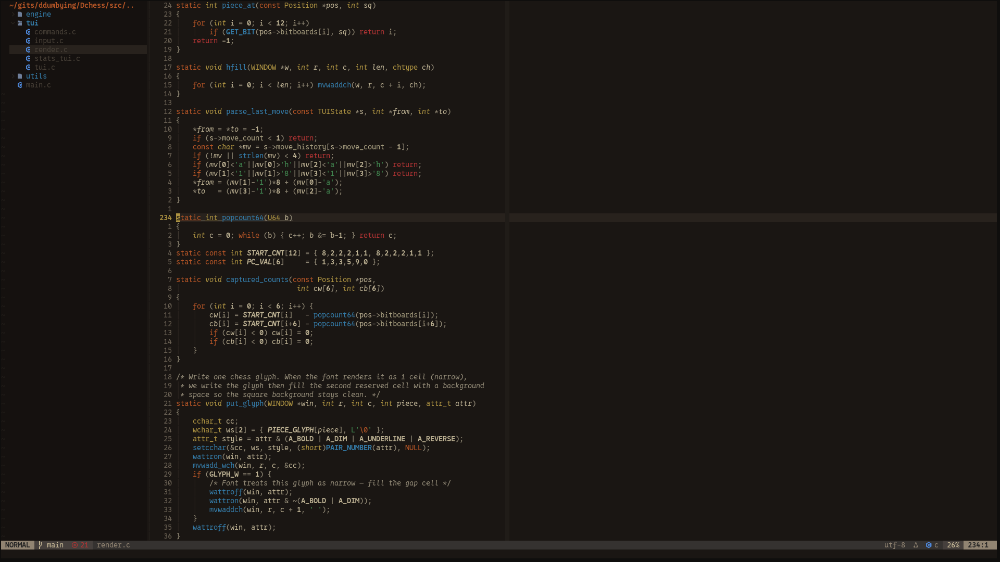
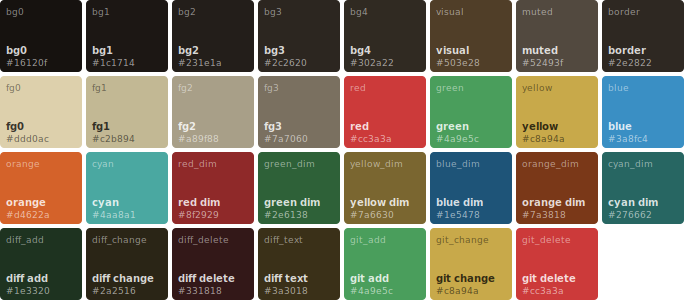
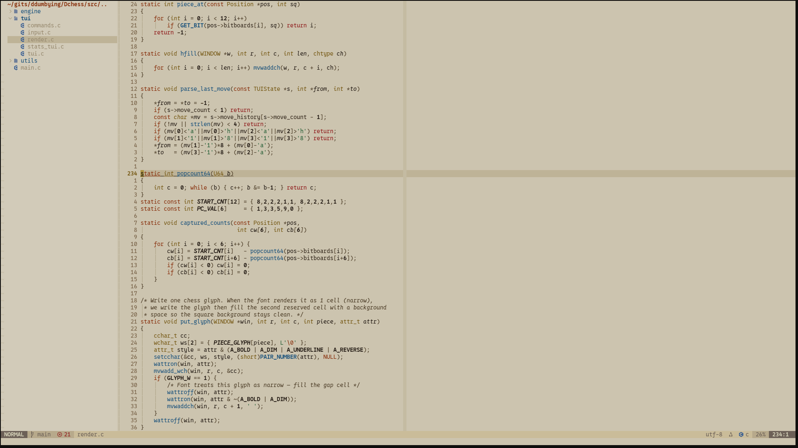
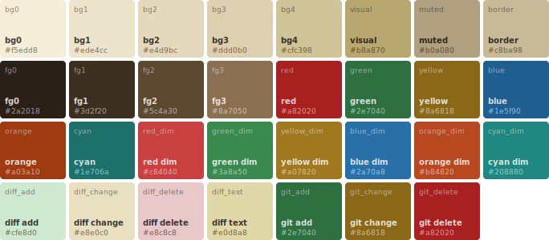

<div align="center">

<h1> <br/>parchment.nvim</h1>

</div>

<p align="center">

  
  
  
  

</p>

## Preview

<details>
  <summary><b>parchment (default)</b></summary>

<br>




</details>

<details>
  <summary><b>parchment-ember</b></summary>

<br>




</details>

<details>
  <summary><b>parchment-manuscript</b></summary>

<br>




</details>

Screenshots are taken from **[Dchess](https://github.com/ddumbying/dchess)** - a small TUI chess project built for fun.

## Installation

**lazy.nvim**

```lua
{
  "saeeedhany/parchment.nvim",
  priority = 1000,
  config = function()
    require("parchment").setup({})
    vim.cmd("colorscheme parchment")
  end,
}
```

**packer**

```lua
use {
  "saeeedhany/parchment.nvim",
  config = function()
    require("parchment").setup({})
    vim.cmd("colorscheme parchment")
  end,
}
```

## Switching Variants

```lua
vim.cmd("colorscheme parchment")             -- deep dark
vim.cmd("colorscheme parchment-ember")       -- lighter dark
vim.cmd("colorscheme parchment-manuscript")  -- light mode
```

## Configuration

All options are optional. These are the defaults:

```lua
require("parchment").setup({
  terminal_colors = true,   -- set vim.g.terminal_color_*
  italic_comments = true,
  italic_strings  = false,
  bold_functions  = false,
  transparent_bg  = false,
  styles          = {},     -- override any highlight group directly
})
```

**Example with overrides:**

```lua
require("parchment").setup({
  italic_comments = false,
  transparent_bg  = true,
  styles = {
    ["@keyword"] = { fg = "#d4622a", bold = true },
  },
})
```

## Lualine

Automatically adapts to whichever variant is active:

```lua
require("lualine").setup({
  options = { theme = require("parchment.lualine") },
})
```

Pin to a specific variant regardless of active colorscheme:

```lua
require("lualine").setup({
  options = {
    theme = require("parchment.lualine").get("parchment-manuscript"),
  },
})
```

## Using the Palette

Access colors directly for use in other plugins:

```lua
-- active variant
local c = require("parchment").palette()

-- specific variant
local c = require("parchment").palette("parchment-ember")

-- example: bufferline
require("bufferline").setup({
  highlights = {
    buffer_selected    = { fg = c.fg0, bold = true },
    indicator_selected = { fg = c.orange },
  },
})
```

## Plugin Support

```
Core              Completion        Git               Navigation
────────────────  ────────────────  ────────────────  ────────────────
Treesitter        nvim-cmp          GitSigns          Telescope
LSP diagnostics   Lualine           Diff highlights   Flash / Hop / Leap
Semantic tokens   Which-key         Neo-tree          Navic
Inlay hints       Trouble           nvim-tree
Terminal colors   nvim-notify
                  Lazy.nvim
                  Mason
                  Snacks.nvim
                  indent-blankline
                  render-markdown
```

## Note

This theme started as a personal project and was later adapted for public use. It is intentionally minimal and does not aim to replicate the feature depth or visual complexity of larger themes.

If you want additional integrations, stylistic variations, or more advanced features, you can extend it yourself-either by contributing to this repository or by forking it and building your own version.

## Inspiration

* [My personal website palette](https://saeedz.vercel.app/).
* [Gruvbox](https://github.com/gruvbox-community/gruvbox).
* My personal preference.
